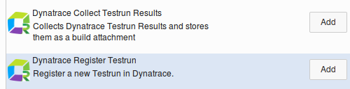
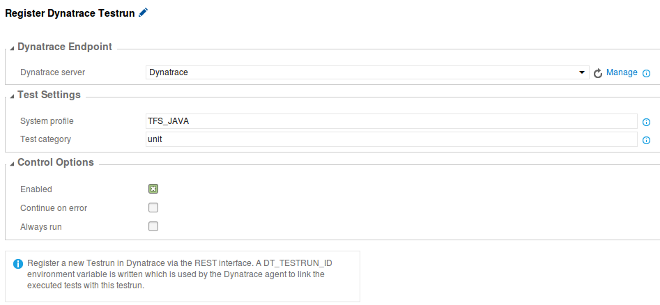
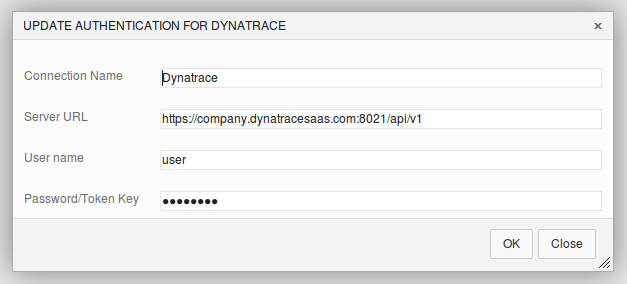
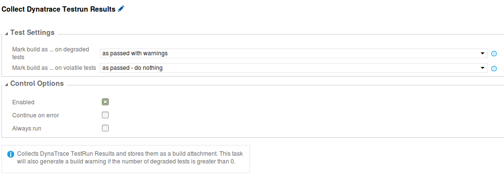
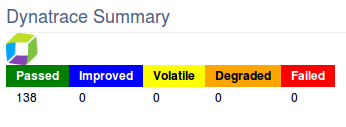

# Dynatrace Test Automation Plugin

Integration of Dynatrace within your TFS/VSTS build. 

Dynatrace can instrument the Unit and Integration tests and does the Test Automation APM magic: [Test Automation Explained](https://community.dynatrace.com/community/display/DOCDT65/Test+Automation+Explained) 

The results flow back to your TFS/VSTS build. You can even configure this extension to fail your build when Dynatrace detects regression issues.

> **Note:** The instrumentation itself is not covered by this extension.

## Get Started ##

It is an important prerequisite that the unit/performance tests which you execute via the TFS or VSTS build are instrumented by Dynatrace first.

### For dotNET
This means installing and configuring the Dynatrace Agent on the different build target machines. Tests are often executed by the following processes, but you need to figure out what applies for your environment.

- vstest.console.exe
- vstest.executionengine.x86.exe
- QTAgent.exe
- QTAgent32.exe, 
- QTAgent_35.exe
- QTAgent32_35.exe, 
- QTAgent_40.exe
- QTAgent32_40.exe

### For Java
This means installing the Dynatrace Agent on the different build target machines. But configuration needs to be done when the JVM starts which will execute your tests. For a project which uses Maven, it can be done like this:

```xml
  <profiles>
    <profile>
      <id>with-dynatrace</id>
      <properties>
        <dt_agent_path>/opt/dynatrace-6.5/agent/lib64/libdtagent.so</dt_agent_path>
        <dt_agent_name>Backend_JUNIT_CHEMAG</dt_agent_name>
        <dt_server>localhost:9998</dt_server>
      </properties>
      <build>
        <plugins>
          <plugin>
            <groupId>org.apache.maven.plugins</groupId>
            <artifactId>maven-surefire-plugin</artifactId>
            <configuration>
                <argLine>-agentpath:"${dt_agent_path}"=name=${dt_agent_name},server=${dt_server}</argLine>
            </configuration>
          </plugin>
```

## Configure Build ##

After installing the extension, you will notice two new `Build tasks` within the `Test section`.



Add the `Dynatrace Register Testrun` task first in the Build Definition. Before you actually perform the unit or performance tests. This step will register the testrun within Dynatrace via a REST call and will add metadata from the build.



You need to configure the endpoint via a `Generic Service Endpoint` which you can select in the drop-down afterwards. You will need to point to the REST service API of you Dynatrace installation which is located by default on port 8021 and has the uri **/api/v1**.



Add the `Dynatrace Collect Testrun Results` task to the Build Definition after the tests were executed. You don't need to configure much as it will detect all it needs from the `Dynatrace Register Testrun` task. It does depend on this first task, so it will fail if you don't configure the first one.

The only thing which you might change is the behavior when Dynatrace detects Degraded or Volatile tests.



## Visualisation in TFS/VSTS  ##

After you run the build with this extension configured, you will notice an extra `Dynatrace Summary` section on the `Build Overview`. As well as a `Dynatrace Test Automation` tab which provides you all the details.



## Release notes ##

> **1.0.0**
> - First public version

Created by `RealDolmen`. All info on [https://github.com/Dynatrace/Dynatrace-TFS-Integration-Plugin](https://github.com/Dynatrace/Dynatrace-TFS-Integration-Plugin)


